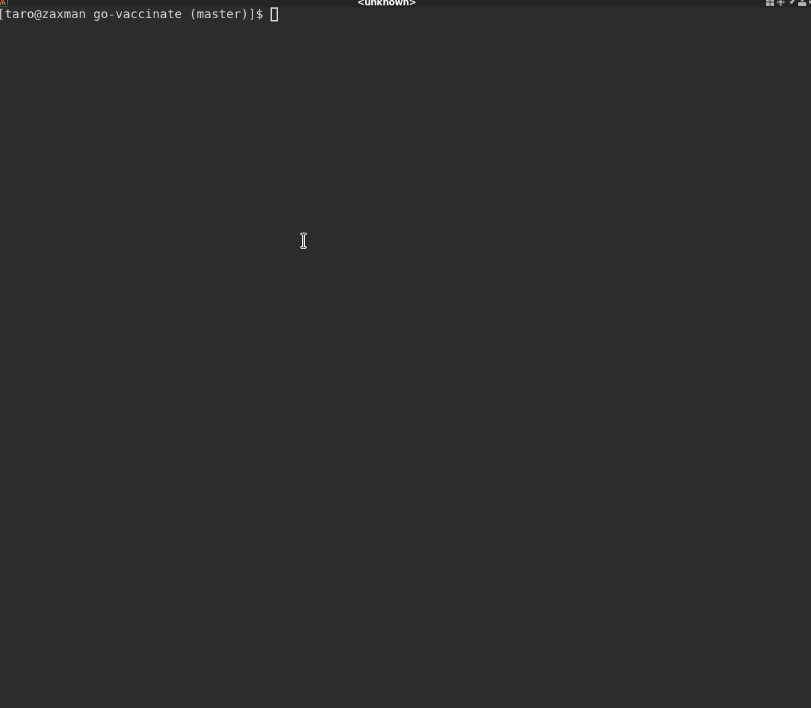

# go-vaccinate

go-vaccinate is a simulator for a hypothetical virus. It uses the <a href="github.com/gizak/termui/v3">termui</a> library for the console graphics. 



## Concept

This program uses a circular linked list, where each node is connected to adjacent nodes. When the simulation starts, the first node is "infected". As the iterator moves around the list, the infected node has a probability of infecting adjacent nodes. Infected nodes can become well if they are sick for the maximum number of days without being infected again. Nodes that are "well" do not infect adjacent nodes.

## Configuration

The sample configuration for the hypothetical gastrorhino disease used by the docker container is shown below. It has a 13% chance to infect adjacent nodes, can be sick for 5 days (implemented as iterations around the linked list). There are 100 people or nodes. Each iteration is additionall scaled to 100 visits. The console simulator can handle more people but the terminal simulator will not be able to display different amounts correctly.

```sh
{
	"CommonName": "Gastrorhino",
	"InfectionRate": 13,
	"MaxSickDays": 5,
	"NumberOfPeople": 100,
	"Visits": 100
}

```

## Building

To build go-vaccinate, you need go 1.14 and modules.

```sh
$ make clean build
```

## Running

The docker container comes with a sample configuration and runs the terminal simulator. Once started it will run continuously until 'q' is pressed. This is the simplest way to run the simulation.

```sh
$ docker run --rm -ti vaccinate 
```

If you want to build go-vaccinate locally, you also have the option of changing the configuration. Run with no options to display usage info.

```sh
$ ./dist/simulator
Usage: simulator [--terminal|--console]

--console will run the simulation and just print the results.
--terminal will run the simulation and display the results using a plot and table
```

The console option will give you a brief menu of options.

```sh
$ ./dist/simulator  --console
Please select command
>
    load  Load configuration from ~/.vaccinate
    run   Run simulation
    quit  Quit
```

You must first *load* the configuration. If ~/.vaccinate is missing, a default one will be created.  You can then *run* the configuration. This can run quickly. Changing the configuration will change the runtime behavior.

```sh
$ ./dist/simulator  --console
Please select command
> load
Please select command
> run
COLUMN                       VALUE
Common name
People                       100
Visits                       100
Infection rate               10
Infected count               6
Number of  times infected    37
Number of times cured        31
Please select command
```

